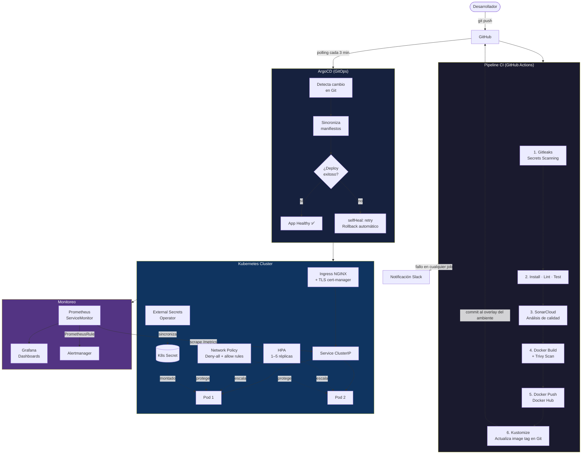

# Prueba Técnica APAP — DevOps Middle

API REST con Node.js/Express desplegada en Kubernetes mediante un pipeline CI/CD completo con GitOps.

---

## Tabla de Contenidos

1. [Arquitectura End-to-End](#arquitectura-end-to-end)
2. [Estructura del Repositorio](#estructura-del-repositorio)
3. [Pipeline CI/CD](#pipeline-cicd)
4. [GitOps con ArgoCD y Kustomize](#gitops-con-argocd-y-kustomize)
5. [Seguridad](#seguridad)
6. [Monitoreo](#monitoreo)
7. [Desarrollo Local](#desarrollo-local)
8. [Endpoints de la API](#endpoints-de-la-api)
9. [Secrets requeridos](#secrets-requeridos)

---

## Arquitectura End-to-End



### Flujo detallado

| Paso | Componente | Descripción |
|------|-----------|-------------|
| 1 | **Gitleaks** | Escanea el historial de commits en busca de secretos filtrados. Bloquea el pipeline si detecta alguno. |
| 2 | **ESLint + Jest** | Linting del código y ejecución de pruebas unitarias con reporte de cobertura (lcov). |
| 3 | **SonarCloud** | Análisis estático de calidad: bugs, code smells, cobertura, duplicados. |
| 4 | **Docker Build + Trivy** | Construye la imagen multi-stage y escanea vulnerabilidades CRITICAL en OS y librerías. |
| 5 | **Docker Push** | Sube la imagen con tag único por ambiente: `dev-YYYYMMDD-sha`, `qa-YYYYMMDD-sha`, `YYYYMMDD-sha` (prod). |
| 6 | **GitOps update** | Kustomize actualiza el `newTag` en el overlay correspondiente y hace commit `[skip ci]`. |
| 7 | **ArgoCD sync** | Detecta el nuevo commit en Git y aplica los manifiestos al namespace del ambiente. |
| 8 | **selfHeal** | Si el estado del cluster diverge del estado en Git, ArgoCD resincroniza automáticamente (rollback). |

---

## Estructura del Repositorio

```
.
├── src/                        # Código fuente Node.js/Express
├── test/                       # Pruebas unitarias (Jest)
├── Dockerfile                  # Multi-stage build (deps → test → production)
├── sonar-project.properties    # Configuración SonarCloud
├── .eslintrc.js                # Reglas ESLint
├── .github/
│   └── workflows/
│       └── ci.yml              # Pipeline CI/CD completo
└── k8s/
    ├── base/                   # Manifiestos base (deployment, service, hpa, ingress, etc.)
    │   ├── deployment.yaml
    │   ├── service.yaml
    │   ├── hpa.yaml            # HPA: CPU 70% / Memoria 80%, 1–5 réplicas
    │   ├── ingress.yaml        # NGINX Ingress con TLS
    │   ├── certificate.yaml    # cert-manager Certificate
    │   ├── cluster-issuer.yaml # ClusterIssuer (self-signed / Let's Encrypt)
    │   ├── network-policy.yaml # Deny-all + allow ingress-nginx + allow DNS
    │   ├── secret-store.yaml   # External Secrets: SecretStore → Vault
    │   ├── external-secret.yaml# External Secrets: ExternalSecret → K8s Secret
    │   └── service-monitor.yaml# Prometheus ServiceMonitor + PrometheusRule
    ├── overlays/
    │   ├── dev/                # Namespace: dev   | Tag: dev-YYYYMMDD-sha
    │   ├── qa/                 # Namespace: qa    | Tag: qa-YYYYMMDD-sha
    │   └── prod/               # Namespace: prod  | Tag: YYYYMMDD-sha + latest
    └── argocd/
        ├── dev-application.yaml
        ├── qa-application.yaml
        └── prod-application.yaml
```

---

## Pipeline CI/CD

### Diagrama de jobs

```
push → [gitleaks] → [test] → [sonar] → [build-and-push] → [update-gitops]
                                                                    ↓ (si falla alguno)
                                                             [notify-failure → Slack]
```

### Tags Docker por rama

| Rama | Tag generado | Ambiente |
|------|-------------|----------|
| `develop` | `dev-20260329-abc1234` | dev |
| `qa` | `qa-20260329-abc1234` | qa |
| `main` | `20260329-abc1234` + `latest` | prod |

### Secrets necesarios en GitHub

| Secret | Descripción |
|--------|-------------|
| `DOCKERHUB_USERNAME` | Usuario de Docker Hub |
| `DOCKERHUB_TOKEN` | Token de acceso Docker Hub |
| `SONAR_TOKEN` | Token de SonarCloud |
| `GITOPS_PAT` | Personal Access Token con permisos de escritura al repo |
| `SLACK_WEBHOOK_URL` | Webhook de Slack para notificaciones de fallo |

---

## GitOps con ArgoCD y Kustomize

### Cómo funciona

ArgoCD monitorea este repositorio cada 3 minutos. Cuando detecta un cambio en el overlay de un ambiente, aplica los manifiestos automáticamente.

```
git push develop
    └─→ CI pipeline
            └─→ kustomize edit set image ...:dev-20260329-abc1234
                    └─→ commit [skip ci] → develop
                            └─→ ArgoCD detecta cambio en k8s/overlays/dev
                                    └─→ kubectl apply → namespace dev
```

### Instalar las Applications en ArgoCD

```bash
# Aplicar las tres Applications al cluster (requiere ArgoCD instalado)
kubectl apply -f k8s/argocd/dev-application.yaml
kubectl apply -f k8s/argocd/qa-application.yaml
kubectl apply -f k8s/argocd/prod-application.yaml
```

### Rollback automático

La configuración `selfHeal: true` en las Applications hace que ArgoCD:
- Detecte cualquier cambio manual en el cluster que diverge de Git
- Resincronice automáticamente al estado deseado en Git
- Reintente hasta 3 veces (5 en prod) con backoff exponencial ante fallos de sync

Para un rollback manual a una versión anterior:
```bash
# Ver historial de revisiones
argocd app history prueba-apap-prod

# Rollback a una revisión específica
argocd app rollback prueba-apap-prod <revision-id>
```

---

## Seguridad

| Componente | Implementación |
|-----------|---------------|
| **Network Policies** | Deny-all por defecto; solo ingress-nginx y Prometheus pueden acceder a los pods |
| **TLS** | cert-manager con ClusterIssuer; NGINX redirige HTTP→HTTPS |
| **Secrets** | External Secrets Operator sincroniza secretos desde HashiCorp Vault |
| **Container security** | `runAsNonRoot`, `readOnlyRootFilesystem`, `drop: ALL capabilities` |
| **Image scanning** | Trivy bloquea el pipeline si encuentra CVEs CRITICAL |
| **Secrets scanning** | Gitleaks es el primer job — bloquea si hay secretos en el código |
| **Least privilege** | Un Service Account por aplicación para autenticación en Vault |

---

## Monitoreo

El stack de monitoreo (Prometheus Operator + Grafana) se descubre automáticamente mediante:

- **ServiceMonitor**: Prometheus scraping en `/metrics` cada 30s
- **PrometheusRule**: Alertas predefinidas:
  - `AppDown` — pod sin responder > 1 min → severity: critical
  - `HighCPUUsage` — CPU > 80% por > 5 min → severity: warning
  - `HighMemoryUsage` — Memoria > 85% del límite por > 5 min → severity: warning
  - `PodCrashLooping` — reinicios continuos → severity: critical

---

## Desarrollo Local

```bash
# Instalar dependencias
npm install

# Ejecutar en modo desarrollo (hot reload)
npm run dev

# Lint
npm run lint
npm run lint:fix

# Pruebas con cobertura
npm test
```

La API estará disponible en `http://localhost:3000`

---

## Endpoints de la API

| Método | Ruta | Descripción |
|--------|------|-------------|
| `GET` | `/` | Mensaje de bienvenida |
| `GET` | `/health` | Health check (usado por liveness/readiness probes) |
| `GET` | `/api/info` | Información de la API |

```bash
# Verificar la aplicación desplegada
curl https://<hostname>/health
```
